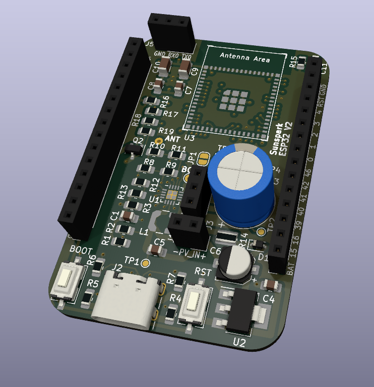

# SunsparkESP32
A new ESP32 hardware platform for low power applications.

This PCB utilizes a small solar cell in order to harvest energy and store it in a supercapacitor.

## Features
1. ESP32 S2 Mini module with a single core MCU: Most projects utilize one core anyway or don't benefit much form a second one. So no current is wasted by idling unnecessary.
2. Native USB support: Converter for RS232 can be connected externally. Many USB to RS232 transceivers have a high quiescent consumption. They are mostly needed for debugging, in order to show data to a console. Flashing the chip also works via the USB bootloader (and is also faster).
3. Integrated open drain MOSFET: Control high power external peripherals and turn them off when not needed.
4. Recharging the supercap can also be done via VBUS from USB. Solder jumper can be set to permanently power module via USB OR via a backup battery (change of threshold resistors might be required).
5. Optional RF95/96/97/98 LoRa module can be added.

## Requirements for external components
1. The open circuit voltage of the solar cell should not exceed 3.3V. Recommended is 1.5V @ 0.65W
2. TBD

## Errata
### V2 board
1. USB VCOM for bootloader not working -> GND from USB and GND1 from ESP differ?
2. BOOT button only working when Supercap is sufficiently charged?
3. Linear 3V3 regulator instantly produced some magic smoke upon connecting VBUS from USB :)

## Current consumption estimation
General testing consists of the board being flashed with a WiFi UDP client.It posts ~50B of data every 10 minutes to a Node RED UDP server. Static IP config is utilized, to avoid waiting for the DHCP.
Active time is about 0.5s, while sleeping the rest of the time.
Values for estimating discharging of capacitor:
### V2 board
Acitve: 45mA; Sleep: 10µA; 50µA average

Improvements mostly due to better ceramic caps (?)
### V1 board
Active: 30mA; Sleep: 90µA; 115µA average

