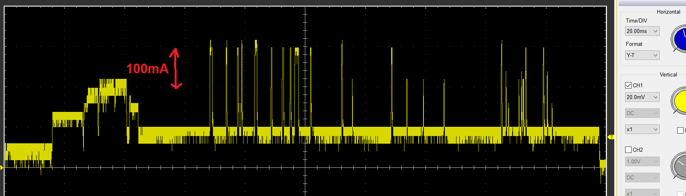

# SunsparkESP32
A new ESP32 hardware platform for low power applications.

This PCB utilizes a small solar cell in order to harvest energy and store it in a supercapacitor.

## Features
1. ESP32 S2 Mini module with a single core MCU: Most projects utilize one core anyway or don't benefit much form a second one. So no current is wasted by idling unnecessary.
2. Native USB support: Converter for RS232 can be connected externally. Many USB to RS232 transceivers have a high quiescent consumption. They are mostly needed for debugging, in order to show data to a console. Flashing the chip also works via the USB bootloader (and is also faster).
3. Integrated open drain MOSFET: Control high power external peripherals and turn them off when not needed.
4. VBUS from USB utilized automatically as backup supply, so debugging does not drain the supercap.
5. Optional RF95/96/97/98 LoRa module can be added.

## Application example
I included some FW which realizes a simple WiFI weather station with a common BME280. However it can be easily altered to work with different or more sensors as well. It works well enough that it can sustain it's 10min scheduled data delivery indoors, in my living room.

Shutting down/entering deepsleep immediately after sending the UDP packet seems not to work (underlying RTOS or network stack takes some time). Thus I additionally set up the the UDP Server in a way that it sends a small sting back, upon receiving data.
The provided code does not utilizes this any further, but it could be a nice way for a two way communication. The ESP32 will run 1s at most, an then enter sleep again:

There is also some small logic, which handles a depletion (or charging) of the supercap by altering the deepsleep period.

I found it helpful to include a runtime checked "debug mode". Tieing a GPIO to high, and to "artificially" shorten the sleep time, so I can debug more easily. Setting it to low put it back into "normal" mode and also disabled some UART prints.

Note: Altered Adafruit_BME280::begin so that is does NOT call
Adafruit_BME280::init upon each wakeup of device -> sensor is permanently
supplied with VCC and does not need a lengthy re-init each time

## Requirements for external components
1. The open circuit voltage of the solar cell should not exceed 3.3V. Recommended is 1.5V @ 0.65W
2. TBD

## Errata
### V2 board
1. USB VCOM for bootloader not working -> GND from USB and GND1 from ESP differ?
2. BOOT button only working when Supercap is sufficiently charged?
3. Linear 3V3 regulator instantly produced some magic smoke upon connecting VBUS from USB :) There seem to be different pinouts for the same footprint of the same IC!
4. VREF for ADP5090 is too low and not constant

## Charging estimation
### V2 board
In direct sunlight: ~40mA, in the shade with average cloudiness: 2mA.

## Current consumption estimation
General testing consists of the board being flashed with a WiFi UDP client. It posts ~50B of data every 10 minutes to a Node RED UDP server. Static IP config is utilized, to avoid waiting for the DHCP.
Active time is about 0.5s, while sleeping the rest of the time.
The challenge are the short current bursts when the WiFi peripheral is actively used:

Values for estimating discharging of capacitor:
### V2 board
Active: 45mA; Sleep: 10µA; 50µA average

Improvements mostly due to better ceramic caps (?)
### V1 board
Active: 30mA; Sleep: 90µA; 115µA average

